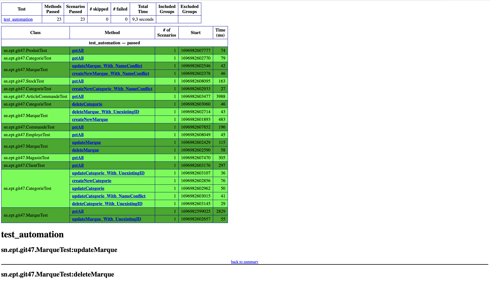

# Test Automation

Ceci représente un projet Maven à part entière qui exploite la puissance de RestAssured et de TestNG pour tester en intégralité notre service web mise en place avec Jakarta EE dans le cadre du projet du cours de J2E.

[Complete Demo](https://drive.google.com/file/d/1rU75WlSSbSN83gdDAUZ_i9IrBZ0G9m9o/view?usp=share_link)

## Images

